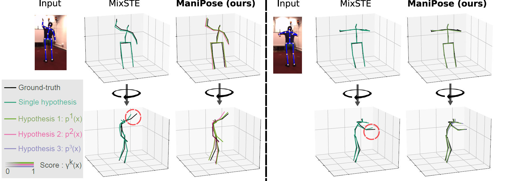
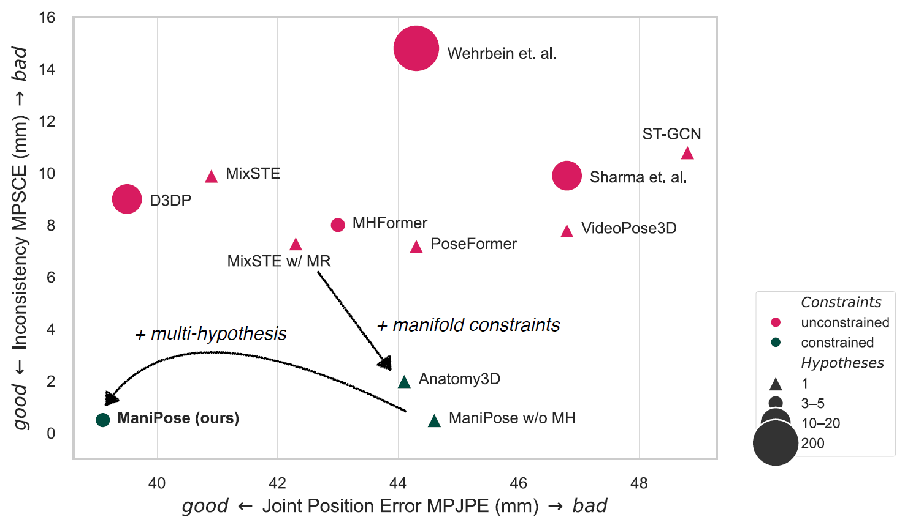
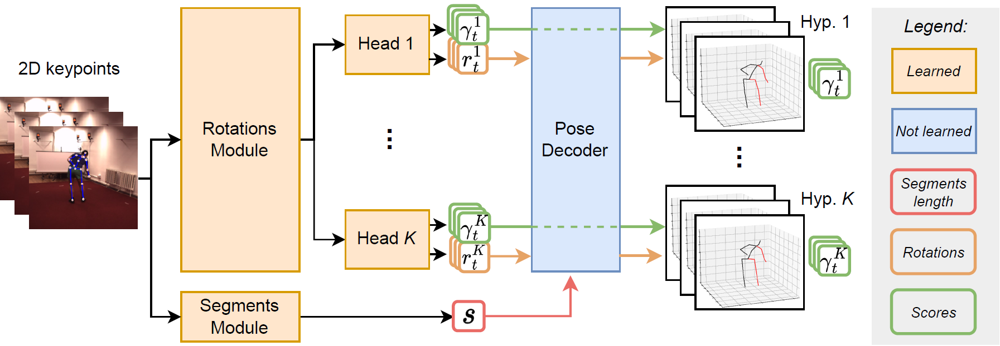
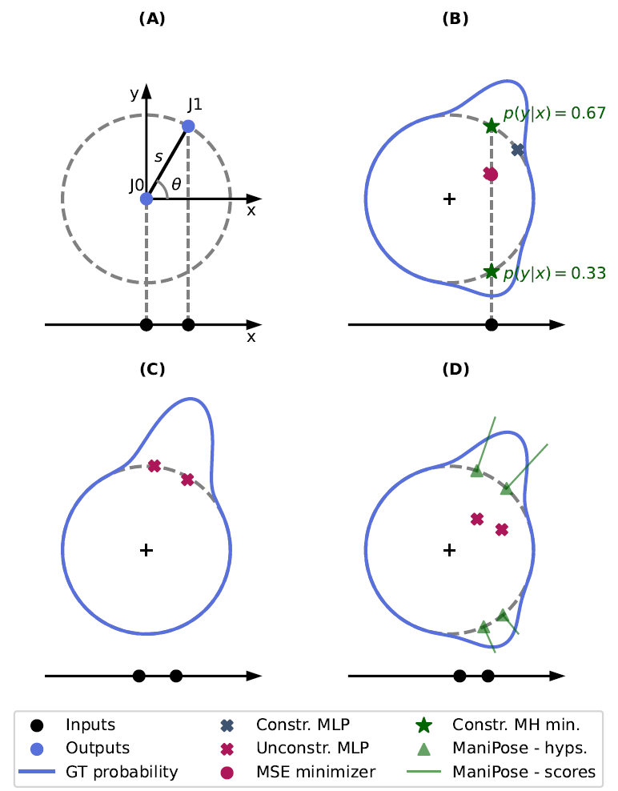

<div align="center">
<h1> ManiPose: Manifold-Constrained Multi-Hypothesis 3D Human Pose Estimation </h1>
<h3> Cédric Rommel, Victor Letzelter, Nermin Samet, Renaud Marlet, Matthieu Cord, Patrick Pérez, Eduardo Valle
</h3>
<!-- <h4> <i> International Conference on Computer Vision (ICCV), <br> Workshop Analysis and Modeling of Faces and Gestures, 2023 </i></h4> -->


[[arXiv](https://arxiv.org/abs/2312.06386)]
<!-- [[webpage](https://valeoai.github.io/blog/publications/diffhpe.html)] -->

<p align="center">  </p>
</div>

<div align="center"> <h3> Abstract </h3>  </div>
<div align="justify">

We propose *ManiPose*, a manifold-constrained multi-hypothesis model for human-pose 2D-to-3D lifting. We provide theoretical and empirical evidence that, due to the depth ambiguity inherent to monocular 3D human pose estimation, traditional regression models suffer from pose-topology consistency issues, which standard evaluation metrics (MPJPE, P-MPJPE and PCK) fail to assess. ManiPose addresses depth ambiguity by proposing multiple candidate 3D poses for each 2D input, each with its estimated plausibility. Unlike previous multi-hypothesis approaches, ManiPose forgoes generative models, greatly facilitating its training and usage. By constraining the outputs to lie on the human pose manifold, ManiPose guarantees the consistency of all hypothetical poses, in contrast to previous works. We showcase the performance of ManiPose on real-world datasets, where it outperforms state-of-the-art models in pose consistency by a large margin while being very competitive on the MPJPE metric.

<p align="center">  </p>
</br>

# Getting started

## Requirements
The code requires Python 3.7 or later. The file [requirements.txt](requirements.txt) contains the full list of required Python modules.
```
pip install -r requirements.txt
```

You may also optionally install MLFlow for experiment tracking:
```
pip install mlflow
```

## Data
The [Human3.6M](http://vision.imar.ro/human3.6m/description.php) dataset was set following the [AnyGCN](https://github.com/tamasino52/Any-GCN#benchmark-setup) repository.
Please refer to it to set it up.

The MPI-INF-3DHP data can be obtained from the [official website](https://vcai.mpi-inf.mpg.de/3dhp-dataset/) or, alternatively, using the [MMPose library](https://github.com/open-mmlab/mmpose/blob/6d10b2ec81da7e252016b3154c7fdb46c403ecd8/tools/dataset_converters/preprocess_mpi_inf_3dhp.py#L190). **(TO CHECK WITH NERMIN)**

Consider adding the path to where the data is stored to the `data.data_dir` field in the `conf/config.yaml` file. Alternatively, this information can also be passed directly to the training/test command line if preferred, as explained below.

## Checkpoints
You can download checkpoints of pretrained models from the assets of the last code release, and put them inside `checkpoints`.

<p align="center">  </p>

# Evaluation

Once checkpoints and data are correctly downloaded and moved to their correct locations, you can evaluate the models by simply running the commands below:

### Human 3.6M
<!-- ```bash
python main_h36m_lifting.py \
    +data=lifting_cpn17_test_seq243 \
    run.experiment=reeval_best_rmcl_cpn_243 \
    run.viz=True \
    model.arch=rmcl_manifold \
    model.mup=False \
    multi_hyp.n_hyp=5 \
    train.rmcl_score_reg=0.5 \
    train.batch_size=3 \
    train.batch_size_test=10 \
    train.lr=4e-5 \
    model.rot_dim=6 \
    run.checkpoint_model=/home/crommel/shared/crommel/mlflow_files/mlruns/588654481840722575/70c770845f4f4542990cc7e22b00b5f5/artifacts/model_best_mpjpe.pth \
    run.train=False \
    run.test=True
``` -->
```bash
python hpe/main_h36m_lifting.py \
    run.checkpoint_model=hpe/checkpoints/manipose_h36m.pth \
    run.train=False \
    run.test=True \
    data.data_dir=/PATH/TO/H36M/DATA/
```

### MPI-INF-3DHP
```bash
python hpe/main_3dhp.py \
    run.checkpoint_model=hpe/checkpoints/manipose_3dhp.pth \
    +data=mpi_inf_3dhp \
    train.batch_size=30 \
    train.batch_size_test=30
    run.train=False \
    run.test=True \
    data.data_dir=/PATH/TO/MPI/DATA/
```

Note that you can omit the `data.data_dir` part of the command if you filled the corresponding field in `conf/config.yaml` beforehand.

# Visualization
Given a pre-trained model checkpoint, you can visualize the predicted poses using the script `viz.py`. For example:
<!-- ```bash
python viz.py data.data_dir=/PATH/TO/H36M/DATA/ eval.model_l=pre-trained-models/diff_model_ckpts/diffhpe-wrapper viz.viz_limit=600
``` -->
<!-- ```bash
python viz.py \
    model.arch=\'mixste,rmcl_manifold\' \
    run.checkpoint_model=\'/home/crommel/shared/crommel/mlflow_files/mlruns/951869235231703365/e0b2027ecc6a49418ea19344bbd6194d/artifacts/model_best_mpjpe.pth,/home/crommel//shared/crommel/pre-trained-models/mh_so3_hpe/best_rmcl_model_27f_5hyps/model_best_mpjpe.pth\' \
    +data=lifting_cpn17_test_seq27 \
    +model=small \
    model.mup=False \
    run.train=False \
    train.batch_size_test=10 \
    multi_hyp.n_hyp=5 \
    viz.viz_video=/home/crommel/shared/crommel/h36m_data/videos/S11/Videos/Greeting.54138969.mp4 \
    viz.viz_action=greeting \
    viz.viz_subject=S11 \
``` -->
```bash
python viz.py \
    run.checkpoint_model=hpe/checkpoints/manipose_h36m.pth \
    run.train=False \
    viz.viz_action=greeting \
    viz.viz_subject=S11 \
    viz.viz_limit=600
```
The mp4 or gif created will be saved inside a new `figures` folder.

In case you have access to the videos from the [official Human 3.6M dataset](http://vision.imar.ro/human3.6m/description.php), you can set them as the background of the visualization by passing their path to the additional command line argument `viz.viz_video=/PATH/TO/VIDEO`.

Other visualization configurations can be changed within the `viz` field, in `conf/config.yaml`.

<p align="center">  </p>

# Training

### Human 3.6M
To train ManiPose from scratch on H36M, run:
<!-- python main_h36m_lifting.py data.data_dir=/PATH/TO/H36M/DATA/ +train=diffhpe-2d +diffusion=diffhpe-2d -->
<!-- ```bash
python main_h36m_lifting.py \
    +data=lifting_cpn17_test_seq243 \
    run.experiment=reeval_best_rmcl_cpn_243 \
    run.viz=True \
    model.arch=rmcl_manifold \
    model.mup=False \
    multi_hyp.n_hyp=5 \
    train.rmcl_score_reg=0.1 \
    train.batch_size=3 \
    train.batch_size_test=10 \
    train.lr=4e-5 \
    model.rot_dim=6 \
    run.train=True \
    run.test=True
``` -->
```bash
python hpe/main_h36m_lifting.py \
    run.train=True \
    run.test=True \
    data.data_dir=/PATH/TO/H36M/DATA/
```

### MPI-INF-3DHP
Likewise, for MPI-INF-3DHP:
```bash
python hpe/main_3dhp.py \
    +data=mpi_inf_3dhp \
    run.train=True \
    run.test=True \
    train.batch_size=30 \
    train.batch_size_test=30 \
    data.data_dir=/PATH/TO/MPI/DATA/
```
<!-- ```bash
python main_3dhp.py \
    +data=mpi_inf_3dhp \
    run.experiment=mpi_inf_3dhp_fixed \
    run.viz=True \
    model.mup=False \
    model.arch=rmcl_manifold \
    multi_hyp.n_hyp=5 \
    train.rmcl_score_reg=0.1 \
    model.rot_dim=6 \
    train.batch_size=30 \
    train.batch_size_test=30
``` -->

# 1D-to-2D toy experiment

Figure 4 can be reproduced in ~2 minutes using a ~10GB GPU. Just run the following command:
```bash
cd toy_experiment ; python plotting_script.py
```

You should find the corresponding figures in the `./figures` folder:
<p align="center">  </p>

Table 1 can also be reproduced in ~2 minutes using the following command:
```bash
bash toy_experiment/quantitative_comparison_toy2d.sh
```

# Acknowledgments

The basis of the human pose lifting code was borrowed from [DiffHPE](https://github.com/valeoai/diffhpe), which builds on top of several other repositories, including:
- [AnyGCN](https://github.com/tamasino52/Any-GCN#benchmark-setup)
- [SemGCN](https://github.com/garyzhao/SemGCN)
- [VideoPose3D](https://github.com/facebookresearch/VideoPose3D)

The baseline model MixSTE was modified from its [official paper repository](https://github.com/JinluZhang1126/MixSTE).

## Citation

```bibtex
@inproceedings{rommel2024manipose,
    title={ManiPose: Manifold-Constrained Multi-Hypothesis 3D Human Pose Estimation},
    author={Cédric Rommel and Victor Letzelter and Nermin Samet and Renaud Marlet and Matthieu Cord and Patrick Pérez and Eduardo Valle},
    booktitle = {Advances in Neural Information Processing Systems},
    publisher = {Curran Associates, Inc.},
    volume = {37},
    year = {2024}
}
```
